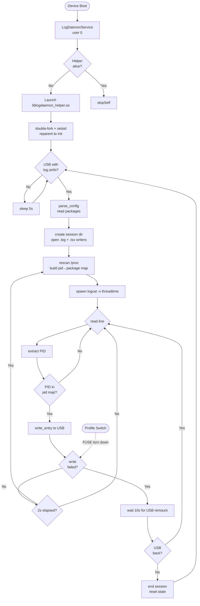
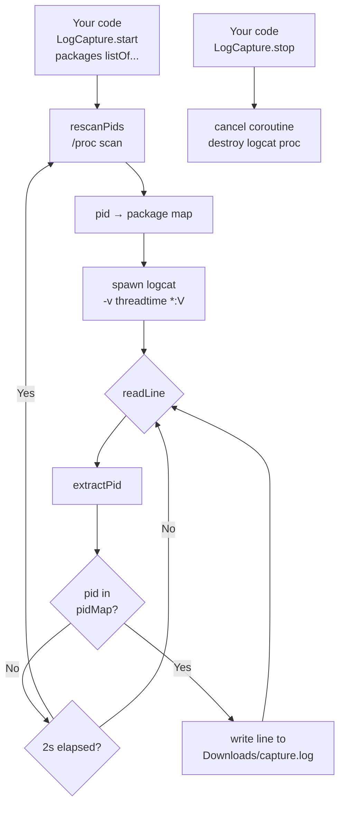
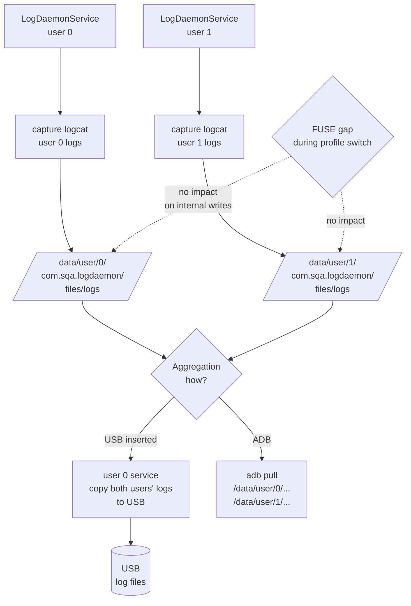
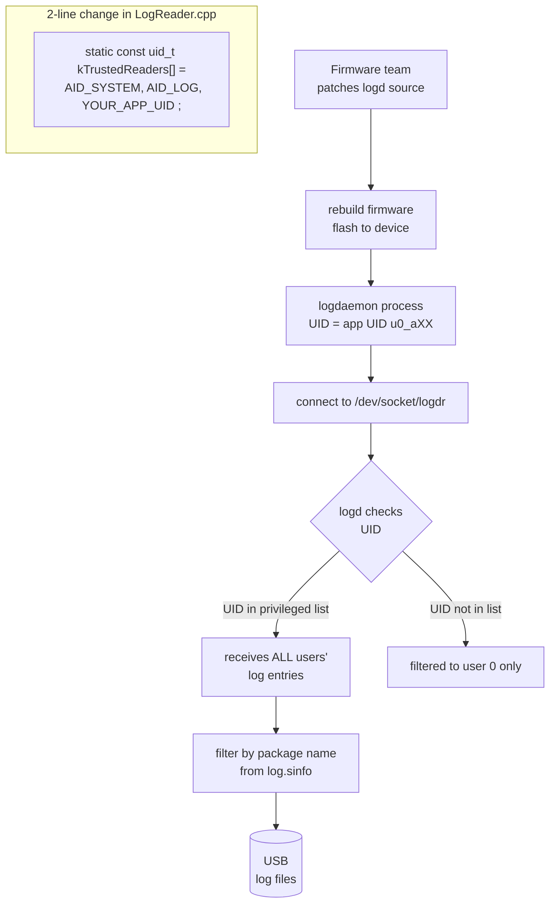
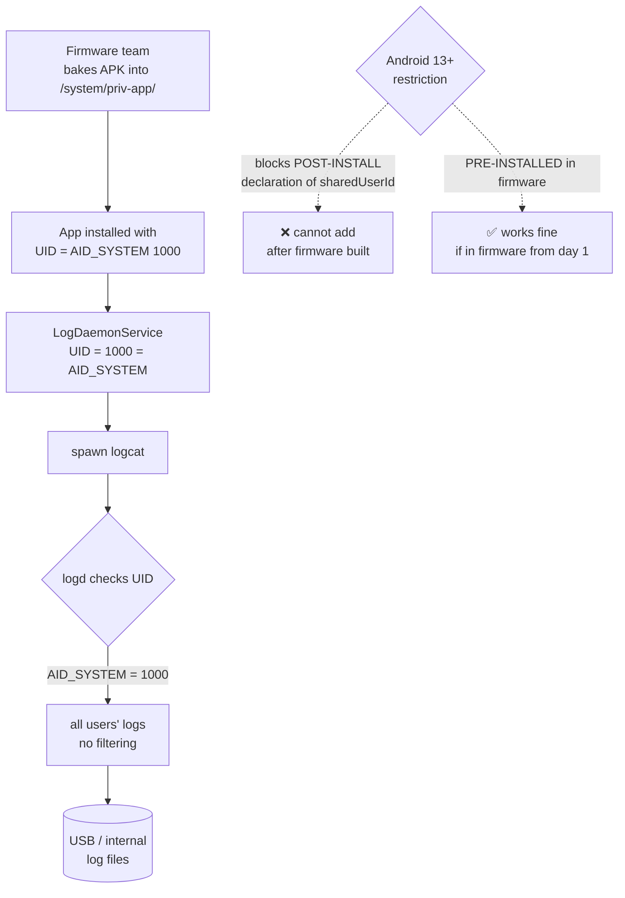
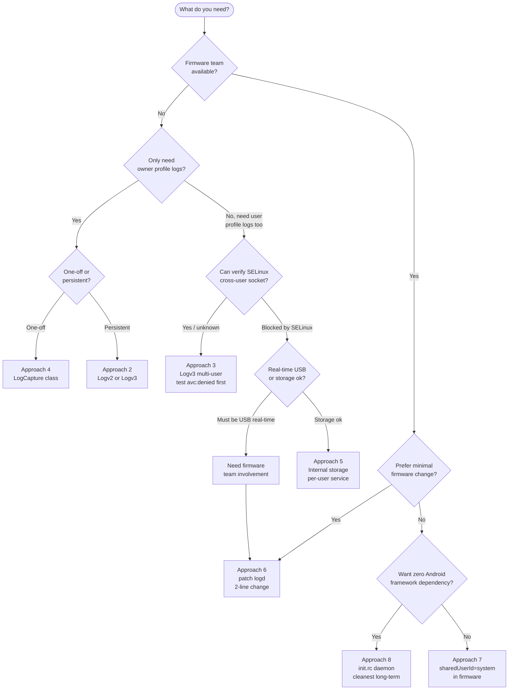

# Android Logger — Approaches & Feasibility

All discussed architectures for capturing logcat across Android user profiles
and writing to USB, with flow diagrams and feasibility assessment.

---

## Quick Comparison

```
Approach                  | Owner logs | User-profile logs | Firmware needed | Status
--------------------------|------------|-------------------|-----------------|--------
Logv2 (helper only)       |     ✅     |        ❌         |       No        | Replaced
Logv3 (socket + service)  |     ✅     |     ⚠️ SELinux    |       No        | Current
Logv3 multi-user fix      |     ✅     |     ⚠️ SELinux    |       No        | Current
LogCapture class          |     ✅     |        ❌         |       No        | Utility only
Internal storage write    |     ✅     |     ⚠️ SELinux    |       No        | Alternative
Firmware: patch logd      |     ✅     |        ✅         |       Yes       | Best
Firmware: sharedUserId    |     ✅     |        ✅         |       Yes       | Alternative
init.rc daemon            |     ✅     |        ✅         |       Yes       | Cleanest
```

---

## Approach 1 — Logv2: Helper Spawns Logcat

The native `.so` helper runs as a daemon, spawns `logcat` directly, scans
`/proc` for PIDs, filters lines by package, writes to USB.



### Logv2 Feasibility

| Factor | Result |
|--------|--------|
| Owner profile logs | ✅ Works |
| User profile logs | ❌ logd filters by user — helper never sees them |
| Profile switch resilience | ❌ FUSE torn down → write fails → new session |
| USB hot-plug | ✅ UsbStateReceiver + hint file |
| Firmware needed | No |

**Verdict:** Works for owner only. Each profile switch creates a new session (log gaps).

---

## Approach 2 — Logv3: Service Streams via Abstract Socket

`LogDaemonService` (user 0, permanent) captures logcat for its own user,
filters by PID, and streams tagged lines to the helper over abstract Unix
socket `@logdaemon`. Helper writes to USB with 8 MB RAM ring buffer for
FUSE gaps.

```mermaid
flowchart TD
    BOOT([Device Boot]) --> SVC0[LogDaemonService\nuser 0 — permanent]
    SVC0 --> LAUNCH[Launch helper if not alive]
    LAUNCH --> HELPER

    subgraph HELPER [liblogdaemon_helper.so — reparented to init]
        HS[setup socket server\n@logdaemon] --> SEL{select loop\n1s timeout}
        SEL -- new client --> ACC[accept connection\ng_client_fd]
        ACC --> SEL
        SEL -- data from client --> RDL[read_line_fd\npkg\\traw_line]
        RDL --> SESS{session\nopen?}
        SESS -- Yes --> WR[write_entry to USB]
        WR -- fail --> RING2[ring_store\nend_session]
        WR -- ok --> SEL
        SESS -- No --> RING2
        RING2 --> SEL
        SEL -- timeout --> USBCK{USB\npresent?}
        USBCK -- No --> TRY[try_open_session\nfind_usb + parse_config]
        TRY -- success --> FLUSH[ring_flush\ndrain buffered lines]
        FLUSH --> SEL
        TRY -- fail --> SEL
        USBCK -- Yes --> SEL
    end

    subgraph SVC0LOOP [LogDaemonService captureLoop — user 0]
        WUSB[waitForUsb\npoll findUsbHint every 3s] --> PSINFO[parseLogSinfo\nread packages]
        PSINFO --> CONN[connectToHelper\n@logdaemon socket]
        CONN --> LOGCAT0[spawn logcat *:V\nthreadtime]
        LOGCAT0 --> SCAN0[rescanPids every 2s]
        SCAN0 --> FILT0{PID matches\npackage?}
        FILT0 -- Yes --> SEND0[write pkg\\tline\\n\nto socket]
        SEND0 --> FILT0
        FILT0 -- No --> FILT0
        SEND0 -- socket fail --> WUSB
    end

    SVC0 --> WUSB
    SEND0 --> RDL

    USB([USB Inserted]) --> MEDIA[MEDIA_MOUNTED\nUsbStateReceiver] --> HINT[writeHintFile] --> WUSB
```

### Logv3 Feasibility

| Factor | Result |
|--------|--------|
| Owner profile logs | ✅ Works |
| User profile logs | ⚠️ Needs multi-user fix below |
| Profile switch resilience | ✅ Ring buffer absorbs FUSE gap |
| USB hot-plug | ✅ |
| Firmware needed | No |
| Cross-user SELinux socket | ⚠️ Must verify on device |

**Verdict:** Owner logs work. User-profile logs need the multi-user service fix.

---

## Approach 3 — Logv3 Multi-User Fix

Remove `singleUser=true` from the service. Android OS automatically runs a
service instance in each user profile. Each instance captures its own user's
logcat and streams to the same `@logdaemon` socket. Abstract Unix sockets are
kernel-level — shared across all user profiles.

```mermaid
flowchart TD
    BOOT0([User 0 Boot]) --> SVC0A[LogDaemonService\nuser 0 instance]
    BOOT1([User 1 Start]) --> SVC1A[LogDaemonService\nuser 1 instance]

    SVC0A --> U0CHK{myUserId?}
    U0CHK -- 0 --> U0LAUNCH[launch helper\nwrite hint file]
    U0LAUNCH --> U0LOOP[captureLoop\nuser 0 logcat]

    SVC1A --> U1CHK{myUserId?}
    U1CHK -- 1 --> U1LOOP[captureLoop\nuser 1 logcat]
    U1CHK -- ≥2 --> SKIP[skip — SecureFolder\nnot wanted]

    U0LOOP --> SOCK0[stream to @logdaemon\nuser0pkg\\tline]
    U1LOOP --> SOCK1[stream to @logdaemon\nuser1pkg\\tline]

    subgraph KERNEL [Kernel — abstract socket namespace shared across ALL users]
        SOCK0 --> DAEMON[@logdaemon\nhelper process]
        SOCK1 --> DAEMON
    end

    DAEMON --> USB[(USB\nlog files)]

    SELINUX{SELinux\nMCS labels\nallow cross-user\nconnect?} -. must verify .-> SOCK1
```

### Multi-User Feasibility

| Factor | Result |
|--------|--------|
| Owner profile logs | ✅ |
| User profile (user 1) logs | ✅ if SELinux allows socket connect |
| SecureFolder (user ≥ 2) | ✅ Explicitly skipped |
| Single helper process | ✅ |
| Firmware needed | No |
| **Blocker** | ⚠️ Samsung SELinux MCS labels may deny cross-user socket `connectto` — verify with `avc: denied` in logcat |

**Verdict:** Best no-firmware-change option. SELinux is the only unknown — check `avc: denied` on device.

---

## Approach 4 — LogCapture Standalone Class

Self-contained Kotlin class. Caller invokes `start(packages)`, class spawns
logcat and writes filtered lines to `Downloads/`. No service, no helper.



### LogCapture Feasibility

| Factor | Result |
|--------|--------|
| Owner profile logs | ✅ |
| User profile logs | ❌ Same logd user isolation — class runs in caller's user |
| No service/helper needed | ✅ |
| USB dependency | ❌ Writes to internal Downloads only |
| Firmware needed | No |

**Verdict:** Good for quick one-off owner-profile captures. Not suitable for cross-user or persistent daemon use.

---

## Approach 5 — Write to Internal Storage

Helper (or service) writes logs to app internal storage instead of USB.
Avoids FUSE mount/unmount issues. Logs retrieved later (ADB pull or copy-to-USB step).



### Internal Storage Feasibility

| Factor | Result |
|--------|--------|
| FUSE gap problem | ✅ Solved — internal storage is raw ext4 |
| Ring buffer needed | ❌ Not needed |
| User profile logs | ⚠️ Still needs per-user service (same logd isolation) |
| Cross-user aggregation | ⚠️ User 0 can access `/data/user/1/` on a platform-signed app |
| Storage limit | ⚠️ Must manage log rotation |
| Real-time USB writing | ❌ Copy step needed |

**Verdict:** Solves stability, not the multi-user capture problem. Good complement to per-user services.

---

## Approach 6 — Firmware: Patch logd

Firmware team adds the app's UID to logd's privileged reader whitelist.
One process, one logcat, all users' logs. Smallest possible firmware change.



### logd Patch Feasibility

| Factor | Result |
|--------|--------|
| All users' logs | ✅ Single process |
| Firmware change | Yes — minimal (2 lines in logd) |
| App architecture change | Minor — remove per-user service split |
| SELinux change | Minimal — existing logd socket rules apply |
| Risk | Low — targeted, no system-wide impact |

**Verdict:** Cleanest firmware-assisted option. Minimal risk, maximum payoff.

---

## Approach 7 — Firmware: sharedUserId="android.uid.system"

APK built into the firmware image with `android:sharedUserId="android.uid.system"`.
App gets AID_SYSTEM (1000) identity — logd gives unfiltered access natively.



### sharedUserId Feasibility

| Factor | Result |
|--------|--------|
| All users' logs | ✅ AID_SYSTEM gets unfiltered logd access |
| Android 13+ compat | ✅ Only if APK is pre-installed in firmware image |
| Android 13+ sideload | ❌ Blocked — INSTALL_FAILED_SHARED_USER_INCOMPATIBLE |
| Architecture simplicity | ✅ No per-user service split needed |
| Risk | ⚠️ AID_SYSTEM has broad system privileges — higher blast radius than logd patch |

**Verdict:** Works if baked into firmware. Higher privilege than needed (prefer logd patch instead).

---

## Approach 8 — init.rc Native Daemon

Binary placed in `/system/bin/` by firmware team. Started by Android `init`
at boot as `user log` (AID_LOG = 1007). Logd treats AID_LOG as a privileged
reader. No Android service layer needed at all.

```mermaid
flowchart TD
    BOOT2([Device Boot]) --> INIT[Android init process\nreads /system/etc/init/logdaemon.rc]
    INIT --> START[start logdaemon\nUID=log GID=log,sdcard_rw]
    START --> SCTX[SELinux context\nu:r:logdaemon:s0]

    SCTX --> USBS2{USB with\nlog.sinfo?}
    USBS2 -- No --> SLEEP[sleep 5s] --> USBS2
    USBS2 -- Yes --> PCONFIG[parse log.sinfo\nread packages]
    PCONFIG --> SESS2[create session dir\nopen writers]
    SESS2 --> LOGCAT4[read logcat\ndirectly — UID=log\nno user filter]
    LOGCAT4 --> ALLP{all profiles'\nlog entries}
    ALLP --> PKGF[filter by\npackage + PID]
    PKGF --> WUSB[write to USB]
    WUSB --> LOGCAT4

    PROFILE2([Profile Switch]) -. daemon unaffected\nnot an Android app .-> LOGCAT4

    subgraph RC [/system/etc/init/logdaemon.rc]
        RCTEXT["service logdaemon /system/bin/logdaemon
  class late_start
  user log
  group log sdcard_rw media_rw
  seclabel u:r:logdaemon:s0"]
    end

    subgraph SEPC [sepolicy/logdaemon.te]
        SETEXT["type logdaemon, domain;
init_daemon_domain(logdaemon)
allow logdaemon logdr_socket:sock_file rw;
allow logdaemon logd:unix_stream_socket connectto;
allow logdaemon sdcard_type:file create_file_perms;"]
    end
```

### init.rc Daemon Feasibility

| Factor | Result |
|--------|--------|
| All users' logs | ✅ user=log → privileged logd reader |
| Profile switch resilience | ✅ init daemon — not an Android app, unaffected |
| FUSE gap | ✅ Process never dies — ring buffer optional |
| Per-user service needed | ❌ Not needed |
| Android service layer | ❌ Not needed |
| Firmware needed | Yes — binary + `.rc` + SELinux policy |
| Code changes | Minor — remove daemonize(), keep everything else |

**Verdict:** Cleanest end-state architecture. Single binary, no Android framework dependency,
captures all profiles natively. Requires firmware team for deployment.

---

## Decision Tree



---

## What to Test First (No Firmware)

Before involving the firmware team, verify Approach 3 on the device:

```bash
# On device as adb shell — switch to user 1, check if user 1 service
# can connect to @logdaemon socket created by user 0 helper

# Look for SELinux denial:
adb logcat | grep "avc: denied"

# Specifically look for:
# avc: denied { connectto } for ... scontext=u:r:priv_app:s0:c<user1_range>
#   tcontext=u:r:priv_app:s0:c<user0_range> tclass=unix_stream_socket

# If NO denial appears and user 1 logs show up → Approach 3 works as-is
# If denial appears → need firmware team for Approach 6 or 8
```
