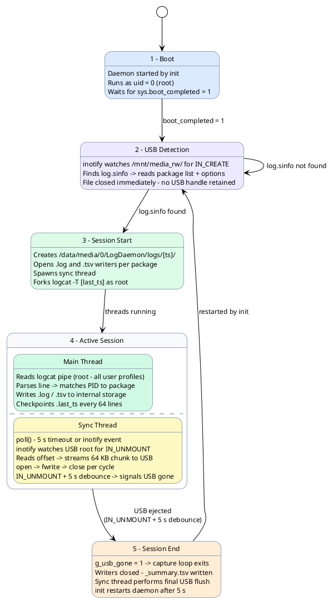
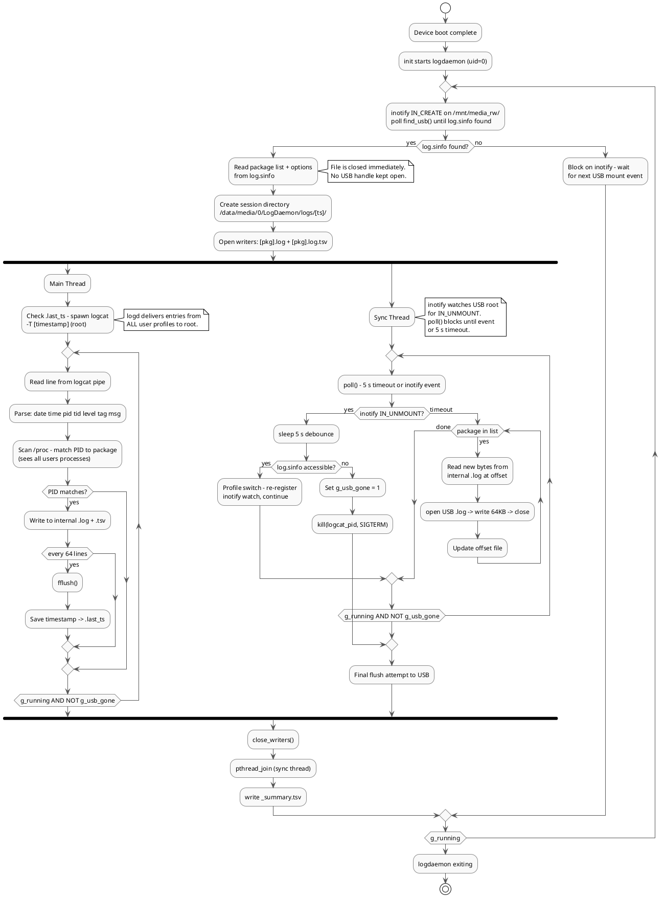
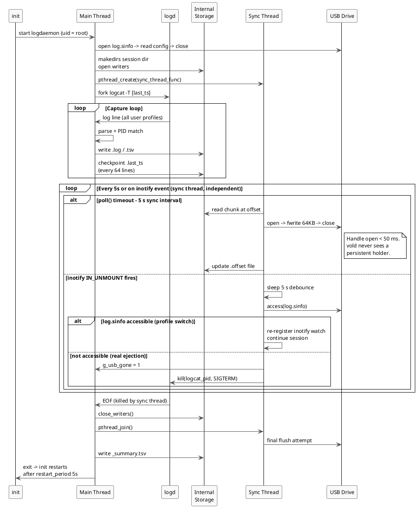

# Logv4 — init.rc Native Daemon

**Status:** Active
**Binary:** `/system/bin/logdaemon`
**Source:** `LogDaemon/app/src/main/cpp/logdaemon_helper.c`

---

## Overview

The init.rc Native Daemon is a root-privileged C process started directly by Android `init` at boot. It replaces the APK service approach by eliminating its fundamental constraint: the inability to run as root.

Running as `user root` via `init.rc` gives the daemon:
- Full logcat access across **all Android user profiles simultaneously**
- Direct access to USB raw FAT mount at `/mnt/media_rw/`
- Immunity to Android user lifecycle (profile switches, user creation/deletion)
- Automatic restart managed by `init`, not the Android framework

---

## System Architecture



---

## Components

### `/system/bin/logdaemon` — Native Binary

The core process. Contains two logical threads:

| Thread | Responsibility |
|---|---|
| **Main (capture)** | Reads from logcat pipe, matches PIDs to packages, writes to internal storage. Never touches USB after startup. |
| **Sync** | Every 5 s: streams new bytes from internal storage to USB in 64 KB chunks. Watches the USB root via `inotify` (`IN_UNMOUNT`) — debounces 5 s to survive profile-switch remounts, then signals the main thread to stop on real ejection. |

### `/system/etc/init/logdaemon.rc` — Service Definition

```rc
service logdaemon /system/bin/logdaemon
    class late_start
    user root
    group root media_rw
    seclabel u:r:shell:s0
    disabled
    restart_period 5

on property:sys.boot_completed=1
    start logdaemon
```

### `/system/etc/permissions/privapp-permissions-logdaemon.xml`

Required only if the companion APK is also installed. Whitelists `READ_LOGS` and `QUERY_ALL_PACKAGES` for the `com.sqa.logdaemon` package. Not required by the native daemon itself.

---

## Key Design Decisions

### 1. Why `user root` in init.rc?

Android's `logd` runtime filters log entries by caller UID. Only UID 0 (root), AID\_SYSTEM (1000), and AID\_LOG (1007) receive entries from all user profiles. The `READ_LOGS` permission does **not** bypass this filter — it only permits access to the socket, not cross-user entries.

Running as root is the only way to receive all-user logs without modifying `logd` source code.

---

### 2. Why `class late_start` with `disabled` + property trigger?

`late_start` ensures `/data/media/0/` and `/mnt/media_rw/` are mounted before the daemon runs. Without `disabled`, `init` would start the daemon as part of the class bring-up — before `sys.boot_completed=1` and before vold has mounted USB volumes.

Using `disabled` + an explicit property trigger guarantees the daemon starts only after storage is fully ready.

---

### 3. Why `restart_period 5` instead of `oneshot`?

With `oneshot`, if `init` receives a stop signal (e.g. vold SIGTERM cascade), the daemon exits permanently until the next reboot. `restart_period 5` instructs `init` to automatically restart the daemon 5 seconds after any exit — covering crashes, SIGTERM, or USB ejection detection.

---

### 4. Why USB as trigger only — not as write destination?

When any process holds open file handles on `/mnt/media_rw/<uuid>/`, vold must send `SIGTERM` before it can manage (unmount, remount, reconfigure) that volume. This caused two problems in the previous approach:

- Every profile switch killed the daemon
- Open handles during a profile switch left the USB volume in a broken state, making it invisible in the secondary user's file manager

The daemon reads `log.sinfo` from USB once, then immediately closes the file. After that, no USB handles exist during capture — vold never targets the daemon, and the USB volume behaves normally across profile switches.

---

### 5. Why write to internal storage (`/data/media/0/`)?

`/data/media/0/` is the credential-encrypted storage for the owner (user 0). It is:
- Always mounted before `late_start` services
- Not subject to per-user FUSE teardown during profile switches
- Accessible as root without any additional permissions
- Visible in the file manager as **Internal Storage → LogDaemon**

This path is completely decoupled from vold's USB management.

---

### 6. Why a dedicated sync thread?

With a single-threaded design, USB sync (file open, write, close) would block the main capture loop. During the stall, logcat output accumulates in the kernel pipe buffer (~64 KB). At high log rates this can overflow, causing dropped lines.

The sync thread runs independently — the main thread's only job is `fgets → parse → write internal storage`. USB I/O never stalls log capture.

---

### 7. Why `logcat -T <timestamp>` on restart?

`logd` maintains an in-memory ring buffer of recent log entries regardless of whether anything is reading them. When the daemon is restarted (by `init` after a 5-second `restart_period`), it reads the last-written timestamp from `/data/media/0/LogDaemon/.last_ts` and passes `-T <timestamp>` to logcat. `logd` replays all buffered entries since that point, covering the restart gap with zero log loss.

---

### 8. Why `inotify` instead of polling for USB events?

The previous design polled `stat(/mnt/media_rw/<uuid>/)` every 5 seconds to detect USB ejection, and watched for `log.sinfo` by scanning `/mnt/media_rw/` on the same interval.

`inotify` eliminates both polls:

| Event | Trigger | Action |
|---|---|---|
| `IN_CREATE` on `/mnt/media_rw/` | vold creates a UUID directory (USB mount) | Wake `find_usb()` immediately |
| `IN_UNMOUNT` on USB root | vold unmounts the volume | Start debounce check |

The main loop blocks in `poll()` on the inotify fd instead of sleeping — USB detection is now instant rather than up to 5 seconds delayed. The sync thread uses the same `poll()` call with a 5-second timeout, so the sync cadence is unchanged while ejection response is immediate.

---

### 9. Why a 5-second debounce on `IN_UNMOUNT`?

`IN_UNMOUNT` fires on **any** unmount of the watched path — including the temporary remount vold performs during an Android profile switch. Without debouncing, every profile switch would stop the capture session and start a new one.

After `IN_UNMOUNT` fires, the sync thread sleeps 5 seconds then checks whether `log.sinfo` is still accessible on the USB path:

- **Accessible** → vold completed a profile-switch remount; re-register the inotify watch and continue the existing session.
- **Not accessible** → real ejection; set `g_usb_gone` and stop capture.

The 5-second wait covers the typical vold remount window during profile switches.

---

## Session Lifecycle Flow



---

## Two-Thread Interaction



---

## How Logs Are Written to USB

Logs are **never written directly to USB**. USB is used only as a mirror, synced from internal storage.

### Flow

1. **Main thread** writes all logs continuously to internal storage `/data/media/0/LogDaemon/logs/<session>/`

2. **Sync thread** wakes every 5 seconds (or immediately on an inotify event) and:
   - Reads the current byte offset from `.sync/<session>/<pkg>_log.off`
   - Opens the internal `.log`, reads a 64 KB chunk from that offset
   - Opens the USB `.log`, writes the chunk, closes immediately
   - Updates the offset file

3. Result: USB mirror is **≤ 5 seconds behind** internal storage

### Why Offset Tracking?

If USB is temporarily missing (profile switch, transient gap), the offset is preserved. When USB comes back, the sync thread resumes from where it left off — no data is lost or duplicated.

### Why open → write → close Every Cycle?

Keeping the USB file handle open would cause vold to send `SIGTERM` to the daemon during profile switches — vold must terminate all holders before it can manage the volume. Opening and closing within each 5-second cycle means the handle is held for under 50 ms. vold never sees a persistent holder.

---

## Output Structure

```
/data/media/0/LogDaemon/              ← Internal Storage/LogDaemon/ in file manager
  logs/
    2026-06-04_10-30-00/              ← one directory per session
      com.example.app.log             ← raw logcat lines
      com.example.app.log.tsv         ← parsed: timestamp, pid, tid, level, tag, message
      _session.meta                   ← start time, packages, USB source
      _summary.tsv                    ← per-package line counts by log level
  .last_ts                            ← resume checkpoint for logcat -T
  .sync/
    2026-06-04_10-30-00/
      com.example.app_log.off         ← bytes synced to USB (.log)
      com.example.app_tsv.off         ← bytes synced to USB (.tsv)

/mnt/media_rw/<uuid>/                 ← USB raw FAT mount
  log.sinfo                           ← config trigger (read once)
  logs/
    2026-06-04_10-30-00/              ← mirror of internal session dir
      com.example.app.log             ← synced copy (≤5s lag)
      com.example.app.log.tsv
```

---

## log.sinfo Format

```ini
[packages]
com.example.targetapp
com.other.package

[options]
min_level=D
upload_url=http://192.168.1.50:8080/upload
```

Place this file at the root of the USB drive. The daemon watches `/mnt/media_rw/` via `inotify` and detects the USB mount instantly when vold creates the volume directory. Ejecting the USB drive stops the current session.

| Option | Required | Meaning |
|---|---|---|
| `min_level` | No (default `D`) | Minimum logcat level captured (`V`/`D`/`I`/`W`/`E`/`F`). Passed to logcat as `*:<level>`. |
| `upload_url` | No | If set, logs are streamed to this HTTP endpoint during the session and finalised on USB ejection. `http://` only — no TLS. Omit to disable upload. |

---

## Server Upload

When `upload_url` is present in `log.sinfo`, the daemon mirrors each package's
`.log` and `.log.tsv` to an HTTP server in addition to the USB and internal-storage
copies. It is a third sync target layered on the existing offset mechanism — the
capture path is untouched.

### How it works

1. At session start the daemon parses `upload_url` into host / port / path. `http://` only; invalid URLs are logged and skipped (capture still proceeds).
2. The sync thread, on every 5 s cycle, streams newly written bytes to the server in 64 KB chunks alongside the USB sync. Each chunk is a `POST` carrying a byte `offset`, so the server writes it at the right position and retries are idempotent.
3. A separate offset file per target (`<pkg>_log.srv.off`, `<pkg>_tsv.srv.off` under `.sync/<session>/`) tracks how many bytes have been confirmed uploaded. The offset advances only on an HTTP 2xx, so a failed or interrupted chunk is retried on the next cycle with no gap or duplication.
4. On USB ejection the session ends. After the internal writers are flushed and closed, the main thread runs one **authoritative** final upload pass (no concurrency with the sync thread, every byte on disk) and then posts an Android notification:
   - **Upload Complete** — every byte of every file reached the server.
   - **Upload Failed** — the server was unreachable or a chunk failed; logs remain safe on internal storage and USB.

The notification is posted via `cmd notification post` (root, no companion APK).

### Request protocol

```
POST <path>?session=<session-id>&file=<pkg>.log&offset=<byte-offset>  HTTP/1.1
Content-Type: application/octet-stream
Content-Length: <chunk size>

<raw chunk bytes>
```

A `2xx` response confirms the chunk; anything else (or a connection failure / 10 s timeout) leaves the offset unadvanced for retry.

### Receiving server

A zero-dependency reference server ships at `tools/upload_server.py`:

```bash
python3 tools/upload_server.py --port 8080
```

It writes each chunk at its declared offset under `uploads/<session>/<file>`, so
the reassembled files are byte-identical to the internal copies. Point `upload_url`
at the PC's LAN address (e.g. `http://192.168.1.50:8080/upload`); the phone and PC
must share a network.

> Only the per-package `.log` and `.log.tsv` are uploaded. `_summary.tsv` and
> `_session.meta` remain on internal storage and USB only.
