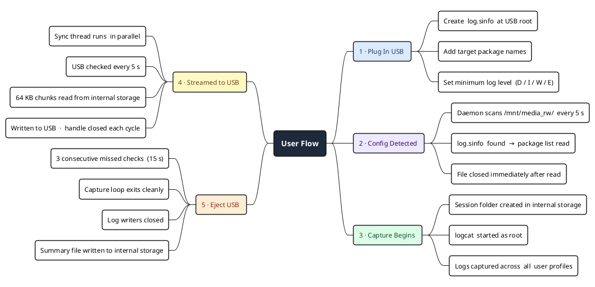

# User Flow

```plantuml
@startmindmap

<style>
mindmapDiagram {
  node {
    BackgroundColor #ffffff
    BorderColor #d1d5db
    FontSize 12
    Padding 10
    RoundCorner 8
  }
  rootNode {
    BackgroundColor #1e293b
    FontColor #ffffff
    FontSize 14
    FontStyle bold
    BorderColor #1e293b
    Padding 14
    RoundCorner 10
  }
  .plug {
    BackgroundColor #dbeafe
    BorderColor #3b82f6
    FontColor #1e3a5f
  }
  .detect {
    BackgroundColor #ede9fe
    BorderColor #7c3aed
    FontColor #3b0764
  }
  .capture {
    BackgroundColor #dcfce7
    BorderColor #16a34a
    FontColor #14532d
  }
  .sync {
    BackgroundColor #fef9c3
    BorderColor #ca8a04
    FontColor #713f12
  }
  .eject {
    BackgroundColor #ffedd5
    BorderColor #ea580c
    FontColor #7c2d12
  }
}
</style>

* User Flow

** 1 · Plug In USB <<plug>>
*** Create  log.sinfo  at USB root
*** Add target package names
*** Set minimum log level  (D / I / W / E)

** 2 · Config Detected <<detect>>
*** Daemon scans /mnt/media_rw/  every 5 s
*** log.sinfo  found  →  package list read
*** File closed immediately after read

** 3 · Capture Begins <<capture>>
*** Session folder created in internal storage
*** logcat  started as root
*** Logs captured across  all  user profiles

-- 4 · Streamed to USB <<sync>>
--- Sync thread runs  in parallel
--- USB checked every 5 s
--- 64 KB chunks read from internal storage
--- Written to USB  ·  handle closed each cycle

-- 5 · Eject USB <<eject>>
--- 3 consecutive missed checks  (15 s)
--- Capture loop exits cleanly
--- Log writers closed
--- Summary file written to internal storage

@endmindmap
```
